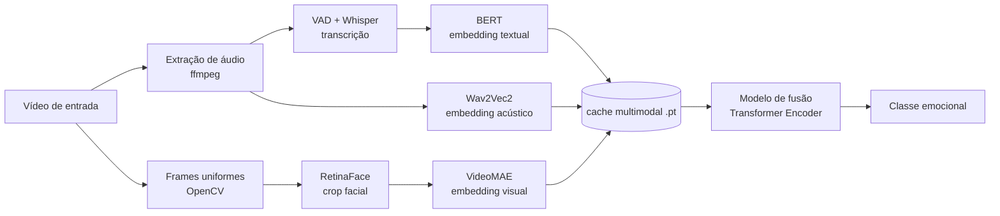
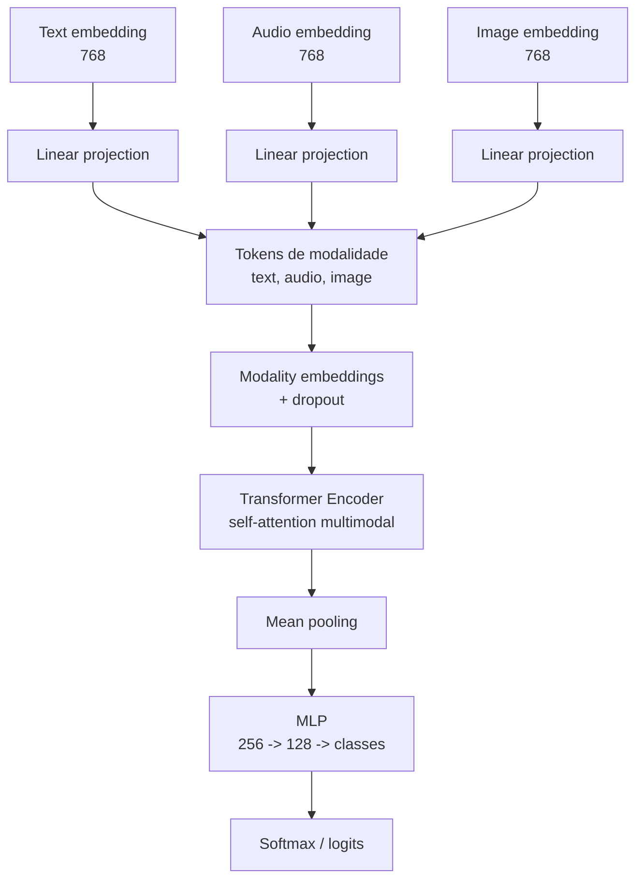

# Emotions Multimodal Recognition

Reconhecimento de emoções em vídeos de pessoas falando, combinando **texto**, **áudio** e **expressões faciais** em uma arquitetura de fusão multimodal com self-attention.

O projeto transforma cada vídeo em três sinais complementares:

- o que foi dito, via transcrição e embedding textual;
- como foi dito, via características acústicas do áudio;
- o que o rosto expressou ao longo do tempo, via sequência de frames faciais.

O diferencial está em separar a extração pesada de características do treinamento do classificador. Backbones pré-treinados geram embeddings em cache uma única vez; depois, o notebook de modelo treina apenas as projeções, o encoder multimodal, o pooling e a cabeça MLP. Isso torna os experimentos mais baratos, comparáveis e fáceis de ablar.

## Por Que Este Projeto Importa

Reconhecer emoção por uma única modalidade é frágil. Texto pode ser ambíguo, áudio pode estar ruidoso e expressões faciais podem variar de pessoa para pessoa. A fusão multimodal permite que o modelo combine pistas semânticas, prosódicas e visuais para tomar decisões mais robustas.

Além disso, o projeto já foi estruturado para experimentação: dá para ligar/desligar modalidades com máscaras, comparar modelos em português e inglês, reaproveitar o mesmo split estratificado e registrar resultados em checkpoints.

## Pipeline



## Arquitetura

Cada amostra cacheada contém três vetores de 768 dimensões e um rótulo:

```python
{
    "text":  Tensor[768],
    "audio": Tensor[768],
    "image": Tensor[768],
    "label": Tensor[]
}
```

No treino, as modalidades ativas são projetadas para uma dimensão comum e empilhadas como tokens. O Transformer aprende relações entre modalidades por self-attention.



Configuração padrão do notebook de treino:

| Bloco | Valor |
| --- | --- |
| Classes | 7 emoções |
| Embedding interno | 256 |
| Heads de atenção | 8 |
| Feed-forward | 1024 |
| Camadas Transformer | 4 |
| Dropout | 0.3 |
| Split | 70% treino, 15% validação, 15% teste |
| Otimizador | AdamW |
| Scheduler | CosineAnnealingLR |
| Early stopping | F1-macro de validação |

## Dados

O dataset principal tem **599 vídeos** distribuídos em 7 emoções:

| Emoção | Amostras |
| --- | ---: |
| Neutral | 93 |
| Surprised | 90 |
| Disgust | 85 |
| Happy | 85 |
| Anger | 84 |
| Fear | 83 |
| Sadness | 79 |

Arquivo tabular usado pelo pipeline:

```csv
video_path,label,label_id
..\videos\Anger\anger_0001.mp4,Anger,0
..\videos\Anger\anger_0002.mp4,Anger,0
..\videos\Anger\anger_0003.mp4,Anger,0
```

### Exemplos De Transcrições

As transcrições abaixo são exemplos extraídos de `processed/transcripts/`:

| Classe | Amostra | Transcrição |
| --- | --- | --- |
| Anger | `anger_0002` | `ruin the punchline of my Japanese` |
| Disgust | `disgust_0001` | `I don't normally do this, but, um,` |
| Fear | `fear_0001` | `Never speak ill of a colleague.` |
| Happy | `happy_0002` | `She must be very proud of you.` |
| Neutral | `neutral_0001` | `I was in fifth grade and I remember all my friends made fun of me.` |
| Sadness | `sadness_0001` | `Can I get him, please?` |
| Surprised | `surprised_0002` | `This is proof of why we don't work, why we'll never work.` |

### Exemplos Visuais

Os dados processados ficam fora do Git por causa do `.gitignore`. Para documentar o projeto sem versionar a base inteira, algumas imagens foram copiadas para `docs/assets/sample-faces/`.

| Anger | Disgust | Fear |
| --- | --- | --- |
|  |  |  |

| Happy | Neutral | Sadness | Surprised |
| --- | --- | --- | --- |
|  |  |  |  |

## Estrutura Do Projeto

```text
.
├── configs/
│   └── requirements.txt
├── datasets/
│   └── dataset.csv
├── notebooks/
│   ├── pre_processing.ipynb
│   └── model.ipynb
├── checkpoints/
│   ├── en/
│   └── pt/
├── cache_en/
├── cache_pt/
├── processed/       # ignorado pelo Git
├── processed_pt/    # ignorado pelo Git
├── videos/          # ignorado pelo Git
├── videos_dub/      # ignorado pelo Git
└── docs/
    └── assets/
        └── sample-faces/
```

## Notebooks

### `notebooks/pre_processing.ipynb`

Responsável por preparar os artefatos que alimentam o treino:

- extrai áudio mono a 16 kHz com `ffmpeg`;
- usa VAD para remover silêncio antes da transcrição;
- transcreve com Whisper;
- amostra frames uniformes do vídeo;
- detecta e recorta rostos com RetinaFace;
- gera embeddings com BERT, Wav2Vec2 e VideoMAE;
- salva caches individuais e um cache multimodal consolidado.

### `notebooks/model.ipynb`

Responsável pelos experimentos de classificação:

- carrega caches `cache_en` ou `cache_pt`;
- habilita modalidades por máscara, como `111`, `110`, `101`, `010`;
- cria projeções apenas para as modalidades ativas;
- treina a fusão com `TransformerEncoder`;
- usa split estratificado fixo para comparação justa;
- aplica mixed precision quando disponível;
- executa grid search opcional;
- registra ablação, métricas e checkpoints.

## Resultados

Resultados atuais salvos em `checkpoints/*/ablation_results_*.csv`, ordenados por F1-macro no teste:

### Dataset PT

| Modalidades | Máscara | Acc teste | F1-macro teste |
| --- | ---: | ---: | ---: |
| text + audio + images | 111 | 0.7222 | **0.6825** |
| text + images | 101 | 0.6333 | 0.5656 |
| text | 100 | 0.6000 | 0.5045 |
| images | 001 | 0.5889 | 0.5012 |
| audio + images | 011 | 0.5778 | 0.4762 |
| text + audio | 110 | 0.5111 | 0.4509 |
| audio | 010 | 0.3000 | 0.2708 |

### Dataset EN

| Modalidades | Máscara | Acc teste | F1-macro teste |
| --- | ---: | ---: | ---: |
| text + audio + images | 111 | 0.7333 | **0.6747** |
| text | 100 | 0.7333 | 0.6726 |
| text + images | 101 | 0.6889 | 0.6580 |
| audio + images | 011 | 0.6333 | 0.6314 |
| text + audio | 110 | 0.6556 | 0.5387 |
| images | 001 | 0.5889 | 0.5012 |
| audio | 010 | 0.5556 | 0.4658 |

Leitura rápida: a configuração multimodal completa lidera nos dois cenários, mostrando o valor da fusão. Em inglês, texto isolado já é muito competitivo, mas a combinação das três modalidades ainda entrega o melhor F1-macro.

## Como Executar

Crie um ambiente Python e instale as dependências:

```bash
pip install -r configs/requirements.txt
```

Execute os notebooks nesta ordem:

```text
1. notebooks/pre_processing.ipynb
2. notebooks/model.ipynb
```

No notebook de treino, as variáveis principais ficam na seção de configuração:

```python
dataset = "pt"          # "pt" ou "en"
grid_search = False     # True para buscar hiperparâmetros
bit_mask = False        # True para rodar por mascara
modals = {
    "text": True,
    "audio": True,
    "images": True,
}
```

Exemplos de máscaras:

| Máscara | Modalidades |
| --- | --- |
| `111` | texto + áudio + imagem |
| `110` | texto + áudio |
| `101` | texto + imagem |
| `011` | áudio + imagem |
| `100` | apenas texto |
| `010` | apenas áudio |
| `001` | apenas imagem |

## Saídas Geradas

| Caminho | Conteúdo |
| --- | --- |
| `processed/audio/` | áudios `.wav` extraídos dos vídeos |
| `processed/transcripts/` | transcrições geradas pelo Whisper |
| `processed/faces/` | frames/crops faciais por amostra |
| `cache_en/` e `cache_pt/` | embeddings cacheados por modalidade |
| `checkpoints/*/best_*.pt` | melhores modelos treinados |
| `checkpoints/*/ablation_results_*.csv` | comparação entre modalidades |
| `checkpoints/*/gridsearch_*.csv` | resultados de busca de hiperparâmetros |

## Roadmap

- consolidar scripts reutilizáveis a partir dos notebooks;
- adicionar avaliação por classe com matrizes de confusão versionadas;
- revisar transcrições PT para reduzir erros de ASR/tradução;
- testar fine-tuning parcial dos backbones;
- empacotar inferência para vídeo único fora do notebook.

## Referência Interna

O arquivo `Projeto_Arquitetura_Multimodal_Reconhecimento_Emocoes.md` documenta a especificação original da arquitetura e serviu como base para os notebooks atuais.
